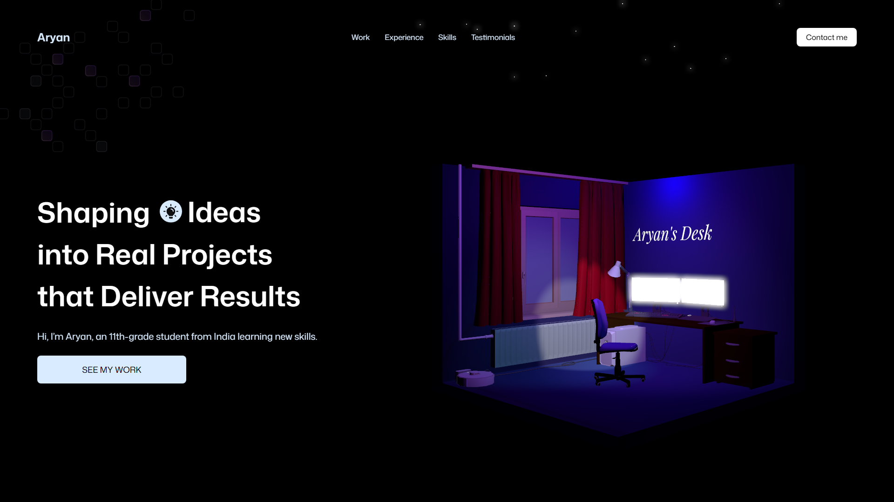

<div align="center">
  <h3 align="center">Aryan's 3D Portfolio</h3>
  <p align="center">
    A visually stunning, modern 3D portfolio showcasing skills and projects.
  </p>
</div>

## 🚨 Disclaimer
**This is a dummy portfolio initialized for GitHub.** It demonstrates a beautiful interactive web design crafted with React, Three.js, and Tailwind CSS. The content within has been adapted for display purposes.

## 📸 Preview



## 🚀 Technologies Used
- **React.js**
- **Three.js & React Three Fiber**
- **Tailwind CSS**
- **Framer Motion**

## 💻 Getting Started
To view this project locally:

1. Clone the repository:
   ```bash
   git clone https://github.com/your-username/3d-portfolio.git
   ```
2. Install dependencies:
   ```bash
   npm install
   ```
3. Run the development server:
   ```bash
   npm run dev
   ```

## 👨‍💻 Personalization
This project has been heavily customized specifically for **Aryan**. All branding, references, and styling have been tweaked to reflect this targeted portfolio design.

---
*Made by Aryan* <3
